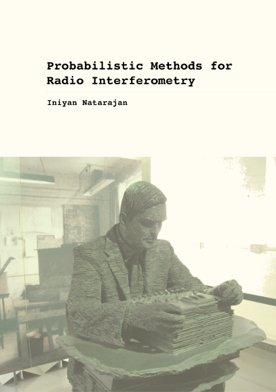
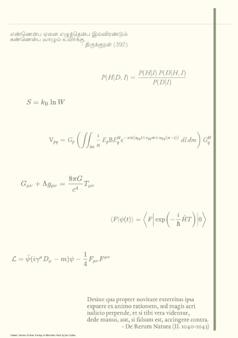

 I am a 
<a href="https://www.nrf.ac.za/division/rcce/instruments/research-chairs">South African Research Chairs Initiative</a> (SARChI) and 
<a href="https://www.sarao.ac.za/">South African Radio Astronomy Observatory</a> (SARAO) funded postdoctoral fellow at the 
University of the Witwatersrand <a href="https://www.wits.ac.za/physics/">School of Physics</a> and SARAO.
I am a member of the <a href="https://eventhorizontelescope.org/">Event Horizon Telescope</a> (EHT) Collaboration.

I am interested in the analysis and synthesis of data from radio telescopes and the application of probability and information theory to problems in astronomy. 

## Publications

A list of my publications can be found [here](https://ui.adsabs.harvard.edu/search/q=%20author%3A%22natarajan%2C%20iniyan%22&sort=date%20desc%2C%20bibcode%20desc&p_=0)
or <a href="https://arxiv.org/search/?query=iniyan+natarajan&searchtype=all&source=header">here</a>.

## Selected Talks

**Do Not Go Gentle Into That Good Night (First EHT Results)** 
*Virtual Open Night, SAAO* ([article](/blog/imaging-a-black-hole/) | [video](https://www.youtube.com/watch?v=9TyhtBqIkLE))

**Probability and Inference in Astronomy** 
*Astronomy & Astrophysics Research Group, IUB* ([video](https://www.youtube.com/watch?v=OlHQC_dU1Oc)) 

## PhD Thesis

 I earned my PhD in Astronomy from the <a href="https://www.uct.ac.za/">University of Cape Town</a> (UCT) for the thesis entitled 
<i>Probabilistic Methods for Radio Interferometry Data Analysis</i>.

 

An excerpt from the preface to my thesis follows. If it piques your interest, you can download the complete thesis from the link at the end.

<b>PREFACE</b>

 The universe as we know it, originated 13.8 billion years ago in a cosmic expansion which created
all of space and time; the planet we call home, 4.5 billion years ago from accreting gas and dust —
leftovers from the formation of the Sun; the <i>we</i> I speak of, a mere 200,000 years ago, from primates
that parted ways with their arboreal cousins and migrated to grasslands. 
<i>Mere?</i> Can we truly comprehend any time span that is longer than a few thousand years at the most? What about the size of
the universe? Travelling at a speed of 300,000 kilometres per second, the speed at which light travels
in vacuum, it would take about 93 billion years to go from one end of the observable universe to the
other. Again, we hit the limits of human perception; limits that were defined by natural selection
that shaped the evolution of our ancestors in the African savannah. That the immense expanse of
the cosmos obeys any set of laws at all, that is at least partially expressible and understandable by us,
is a stroke of luck for any species that endeavours to discover its origins.

 In our efforts to understand Nature, we have so far managed to describe the interactions between
all of observable matter (or energy, which is just another manifestation of matter) in the universe
in terms of four fundamental fields or forces: the strong force, the weak force, electromagnetism,
and gravity. The strong and weak forces govern the interactions between the elementary particles of
matter at the scale of the atomic nucleus. At any scale larger than this, our only guiding forces are
electromagnetism (or sometimes, <i>electroweak</i>, a unification of electromagnetism and the weak force)
and gravity. The effects of both these forces can be felt over large distances; infinite, as far as we know.
Almost all of what we know about celestial objects comes from observing electromagnetic radiation
from space.

 Since the time of Newton’s unweaving of the rainbow in the 17th century, we have understood
much about the nature of electromagnetism. The classical concepts of both <i>particle</i> and <i>wave</i> must
be invoked to get a complete picture of any elementary “particle”, and the quantum of electromagnetism, 
the photon, is no exception to that. Every photon has a wavelength associated with it and
hence can be represented as a wave, and this wavelength determines what techniques we employ in
intercepting and interpreting the photon. The visible light, which gives rise to the magnificent hues
that we see around us, occupies but a tiny fraction of the electromagnetic spectrum. 
The short wavelength (or high frequency) part of the spectrum comprising gamma rays, X-rays, and ultraviolet rays
from outer space is blocked by the upper layers of the atmosphere and hence is observed by telescopes
stationed in space. A significant part of the spectrum with wavelengths longer than those of visible
light and infrared radiation, consisting of short and long wavelength radio waves, is observable from
the surface of the earth and has provided us with evidence of a variety of new celestial phenomena —
from high energy objects such as active galaxies, to a window into the childhood of the universe in
the form of the cosmic microwave background.

 The wave theory of light adequately explains the propagation of electromagnetic waves in the 
radio frequency range. The phenomenon of interference, in which the observed intensity of waves at a
particular point is understood as a superposition of interfering wavefronts, has been put to good use
in building networks of individual telescopes, called interferometers. These interferometers combine
the wavefronts received by different telescopes in a way that enables us to resolve finer structures in
the radio sky, than is possible with a single radio telescope. In this thesis, we are concerned only with
the methods for analysing and understanding the nature of radio observations made using interferometers.

MODELLING PHYSICAL PHENOMENA

 The idea of logic, of reason, of science, has existed long before humans found it necessary to invent
those words. <i>What kind of idea is it?</i> The kind that refuses to go away if ignored; the kind that
rallies and comes back unchanged if lost or suppressed; the kind that, the hundredth time, changes
the world. Not revelation, but reason. Having arrived late on the scene, we are forced to reason
backwards from what little we can observe of the universe, to answer the question of how it came to
be. The information we possess is almost always incomplete, limited by our senses and our location
in space and time.

 To overcome some of these limitations, we have evolved or fashioned tools that aid and extend
our senses. Part of our mental toolkit is our ability to understand the world in terms of <i>models</i>. The
myriad cultural myths that exist are humanity’s attempts to make sense of the world it finds itself in.
It is perhaps not surprising that, for instance, what we perceive as optical illusions are subversions of
the assumptions built into our brains by evolution, as has been proven by numerous experiments in
cognitive science. As faith in inadequate models of the world is eroded, not by disbelief but by doubt,
better models spring into existence, illuminating more and more of the secrets Nature has hidden in
its darkest recesses.

In his <i>Ars Conjectandi</i> (The Art of Conjecturing) published in 1713, Jacob Bernoulli distinguished
between deductive logic and inductive logic, with the latter being our only way forward in the face
of incomplete information. This is a situation we are often confronted with in everyday life, and for
our purposes here, in the natural sciences. Bernoulli, followed by Bayes and Laplace, pioneered the
concept of probability as a measurable degree of certainty or plausibility. In this view, commonly
termed <i>Bayesian</i>, probability represents how much we believe something to be true, having taken
into account all available information that is relevant. In 1946, Richard Cox formulated the theory
of probability as the basic calculus for logically consistent plausible reasoning; in other words, for
<i>scientific inference</i>. As Edwin T. Jaynes noted in response to criticism that this view of probability is
“subjective”, objectivity is achieved when two people having the same information assign the same
probability to an event. Objectivity demands that we consider all the pertinent information available,
not an arbitrarily chosen subset of it. Any such choice would warrant the accusation of us being
subjective, since we would be either ignoring available information or presuming information we do
not possess, both of which would entail further scrutiny.

The scientific method is a way of reasoning from <i>premises</i> and available <i>data</i> to arrive at <i>inferences</i>
about the problem in question. To draw inferences using probability theory, we formulate models of
the scientific phenomenon and test their predictions against the data that have been obtained. Based
on how much a theory predicts the observed data, our belief (or, more accurately, that of a rational
agent) in the theory is modified accordingly. A practical point of concern is that, more often than not,
the mathematical functions that describe the probability distributions corresponding to the model
parameters can be quite complicated and difficult to solve using standard analytical methods. Hence
we resort to methods such as <i>numerical sampling</i>, which involve repeated computations of simpler
mathematical equations and provide approximate solutions to analytically intractable problems at a
fraction of the time. The number of computations and hence the time required to obtain a numerical
solution depend on how accurate we need the results to be. This necessitates the use of computer
algorithms designed to perform computations iteratively on the data, to obtain solutions in a reasonable amount of time.

THE DIGITAL REVOLUTION

In 1936, Alan Mathison Turing published “On Computable Numbers, with an Application to the
<i>Entscheidungsproblem</i>”, culminating the works of David Hilbert and Kurt Gödel on the nature of
logical and mathematical reasoning, and laying the theoretical foundations for the invention of the
electronic computer. In this pioneering paper, he showed that any conceivable algorithm can be
executed by a machine (now known as the “Turing machine”). Insofar as a process can be solved
algorithmically using mathematical equations, a machine that carries out the process can be built. 
Insofar as rational thought is consonant with the rules of logic, a machine that thinks rationally can be
built. Today he is rightfully considered the father of computer science and the founder of the field
of artificial intelligence. John von Neumann and various others built on Turing’s work, eventually
creating machines that were the precursors of the modern digital electronic computer.

Computers today have come a long way from being the hulking behemoths of the mid-twentieth
century. With the invention of semiconducting transistors, and their subsequent integration on silicon 
chips known as integrated circuits (IC) on a very large scale (ICs today can accommodate billions
of transistors), computing power has increased enormously. Algorithms that were considered prohibitively 
costly in terms of execution time three decades ago, have become feasible today. In the past
decade-and-a-half, the development of high performance Graphics Processing Units (GPUs), mainly
driven by the computer gaming industry, has made possible the numerical simulations necessary for
tackling many scientific problems for which analytical solutions are intractable. It is in this technological 
backdrop that a full probability-theoretic approach to solving radio interferometry equations
by exploiting the power of numerical samplers has become possible.

<a href="https://hdl.handle.net/11427/27243"><i>Visit download page</i></a>
